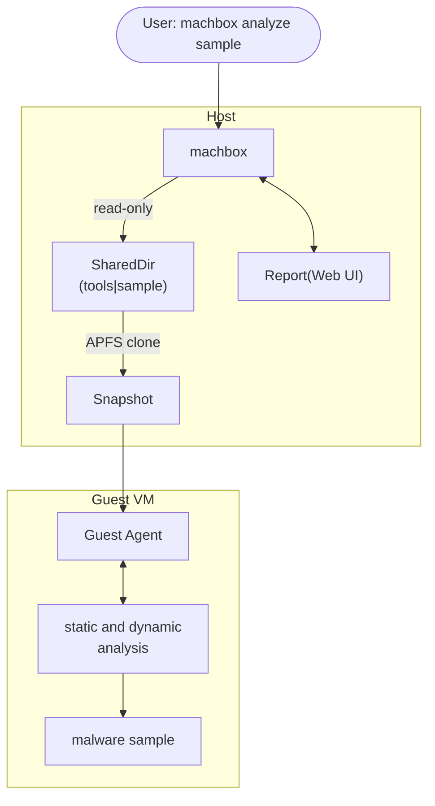

# MachBox

Machbox is a native, lightweight, single-binary malware analysis sandbox for macOS that combines static and dynamic analysis, built on Apple native frameworks (`Virtualization.framework`, `EndpointSecurity.framework`, `DTrace`, etc.).

English | [中文](./docs/README_CN.md)


## Supported Formats

- mach-o
- .app bundle
- zip archive (supports password extraction)

## System Requirements

- **Apple Silicon Mac**
- **macOS 13+**

## Environment Setup

Only needs to be done once. After setup, you can run sample analysis repeatedly.

### 1. Create a Base VM with VirtualBuddy

1. Open [VirtualBuddy](https://github.com/insidegui/VirtualBuddy) and create a new macOS VM.

2. **Uncheck "Enable VirtualBuddy Guest App"** during creation.
    


3. Complete the macOS setup inside the VM (region, account, etc.).

### 2. Disable SIP in the Guest VM

1. In VirtualBuddy, enable **Boot in recovery mode** for the VM.


2. Start the VM and open **Utilities → Terminal** from the menu bar.

3. Run:

   ```bash
   csrutil disable
   ```

4. Restart the VM normally.

### 3. Install the Machbox Guest Agent

On your host machine, run:

```bash
machbox setup -m /path/to/your_Machbox.vbvm
```

Inside the VM:

1. Open Finder and select `MachboxGuest` from the sidebar.
2. Install `machbox-guest.pkg`.
3. Wait for the installation to finish (Xcode Command Line Tools will be installed silently).
4. Shut down the VM.

---

## Analyze Samples

```bash
machbox analyze -m /path/to/your_Machbox.vbvm /path/to/sample
```

Common options:

| Option | Description | Default |
|--------|-------------|---------|
| `-m, --vbvm` | **Required** Path to the VirtualBuddy VM bundle | — |
| `--timeout` | Dynamic analysis timeout (seconds) | `60` |
| `--password` | Password for encrypted archives | — |
| `--headless` | Run without a GUI window (auto-shutdown after analysis) | `true` |
| `--display` | Display resolution | `1920x1200` |
| `--network-mode` | Network mode (e.g., `NAT`) | Disabled |

## View Analysis Reports

All analysis results are automatically stored in a local database and can be viewed through the built-in Web UI:

```bash
machbox report-view
```

Open your browser and visit `http://127.0.0.1:8080` to browse the complete analysis reports.

### Report Preview

| Static Analysis | Dynamic Analysis |
|:--|:--|
|  |  |
|  |  |

## Architecture



## Acknowledgments

- https://github.com/blacktop/go-macho
- https://github.com/Code-Hex/vz
- https://github.com/insidegui/VirtualBuddy
