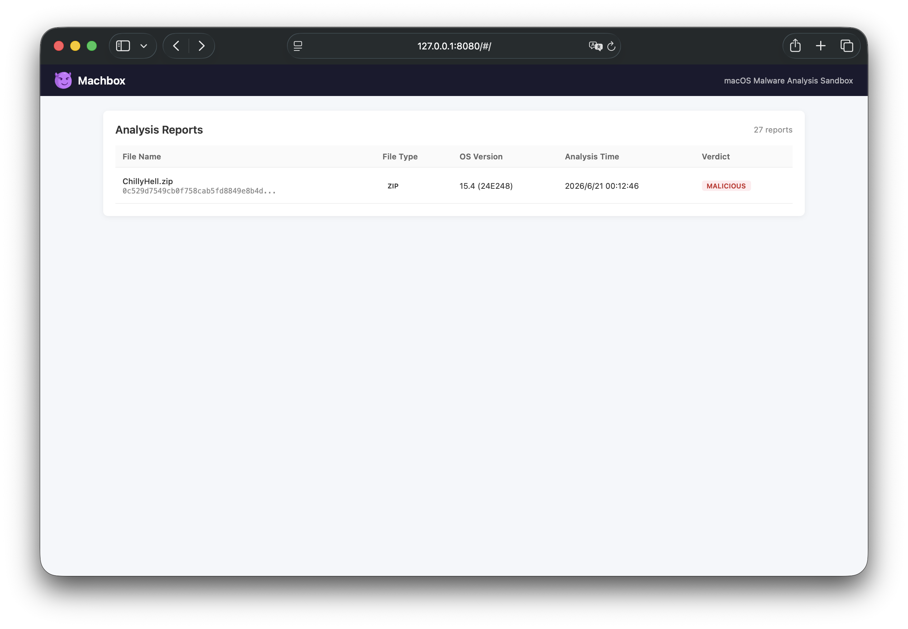
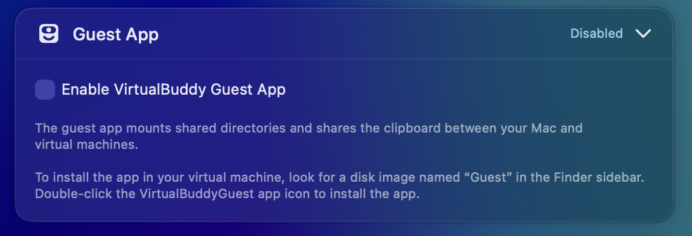
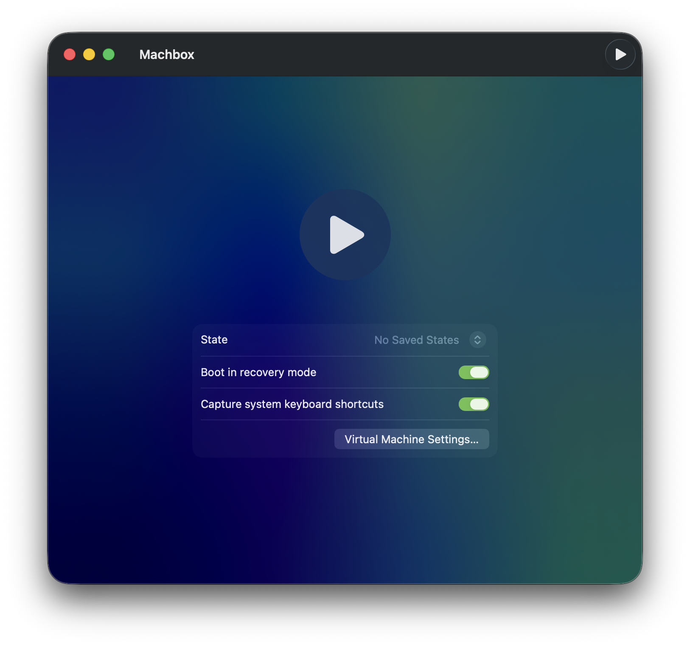
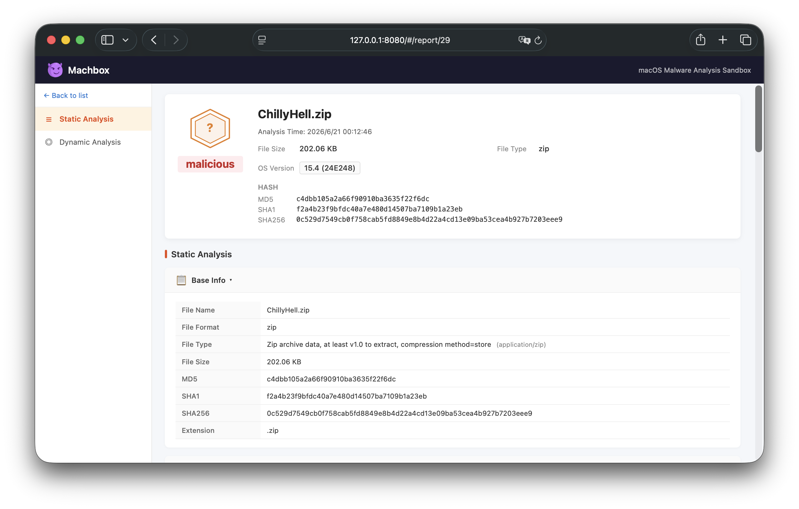
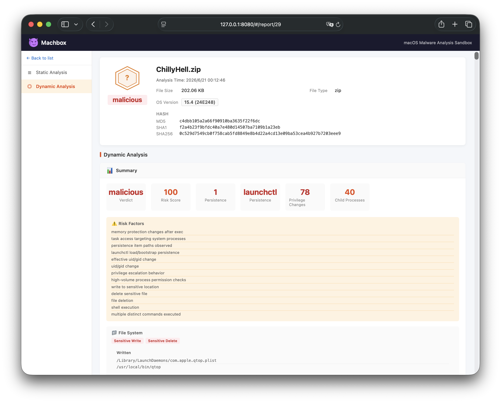
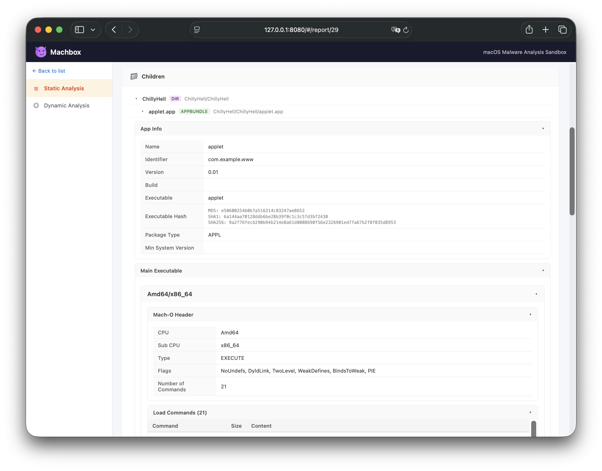
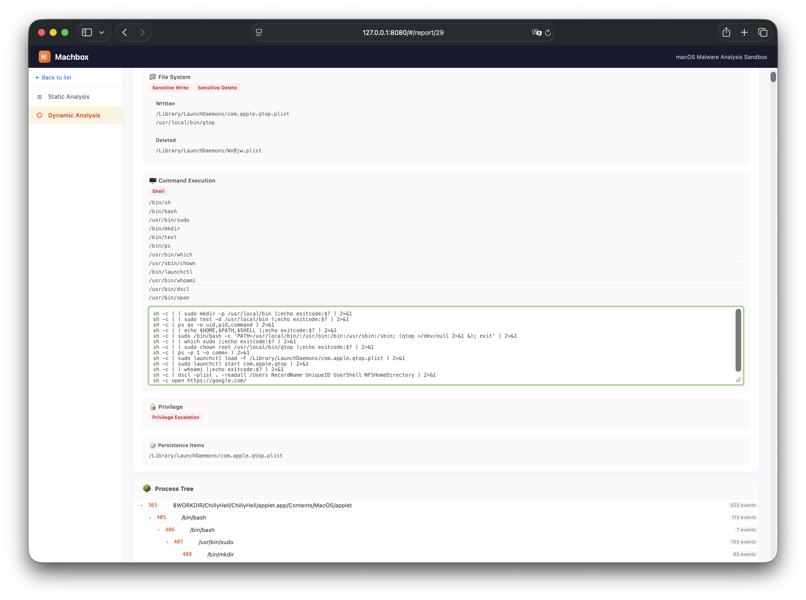
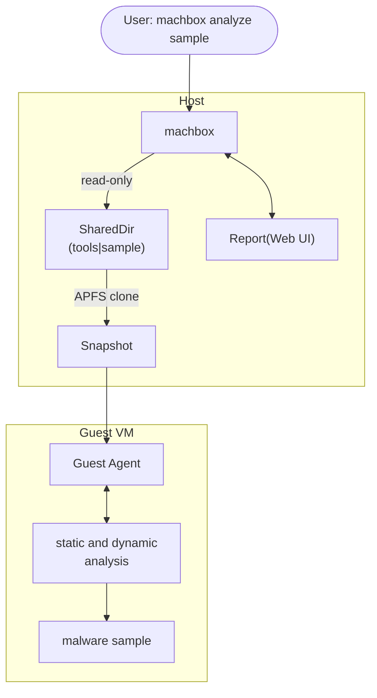

# Machbox

English | [中文](./docs/README_CN.md)

`Machbox` is a lightweight, native macOS sandbox for malware analysis, built on Apple native frameworks (`Virtualization.framework`, `EndpointSecurity.framework`, `DTrace`, etc.).



## Supported Formats

- mach-o
- Application Bundle
- Disk Image(.dmg)
- zip archive (supports password extraction)

## System Requirements

- **Apple Silicon Mac**
- **macOS 13+**

## Technical Highlights

- **Lightweight Deployment**: Single binary, compatible with `VirtualBuddy(.vbvm)`.
- **Native Sandbox**: `Virtualization.framework` + `APFS Clone` snapshot & rollback.
- **Static Analysis**: Mach-O parsing, code signing & entitlements, strings (IOC) extraction, and recursive scanning of directories, archives and app bundles.
- **Dynamic Analysis**: `EndpointSecurity` + `DTrace` for process execution, file-system activity, network connections, persistence attempts, privilege escalation, and code injection detection.
- **Behavioral Summarization**: Risk scoring, verdict generation, and a built-in Web UI to browse full analysis reports.

## Download

Prebuilt Apple Silicon binaries are available on the [GitHub Releases](https://github.com/ac0d3r/machbox/releases) page.

```bash
curl -L -o machbox https://github.com/ac0d3r/machbox/releases/latest/download/machbox-darwin-arm64
chmod +x machbox
```

> The release binary is ad-hoc signed, macOS Gatekeeper will block it until you remove the quarantine attribute with `xattr -d com.apple.quarantine`.

## Build from Source

```bash
git clone https://github.com/ac0d3r/machbox.git
cd machbox
make build
```

The compiled binary will be at `bin/machbox`.

## Environment Setup

Only needs to be done once. After setup, you can run sample analysis repeatedly.

### Create a Base VM with VirtualBuddy
- Open [VirtualBuddy](https://github.com/insidegui/VirtualBuddy) and create a new macOS VM.

    - Optional (during creation, uncheck "Enable VirtualBuddy Guest App")

      

3. Complete the macOS setup inside the VM (region, account, etc.).

### Disable SIP in the Guest VM

1. In VirtualBuddy, enable **Boot in recovery mode** for the VM.



2. Start the VM and open **Utilities → Terminal** from the menu bar.

3. Run:

   ```bash
   csrutil disable
   ```

4. Restart the VM normally.

### Install the Machbox Guest Agent

On your host machine, run:

```bash
machbox setup -m /path/to/your_Machbox.vbvm
```

Inside the VM:

1. Open Finder and select `MachboxGuest` from the sidebar.
2. Install `machbox-guest.pkg`.
3. Wait for the installation to finish (Xcode Command Line Tools will be installed silently).
4. Shut down the VM.

---

## Analyze Samples

```bash
machbox analyze -m /path/to/your_Machbox.vbvm /path/to/sample
```

Common options:

| Option | Description | Default |
|--------|-------------|---------|
| `-m, --vbvm` | **Required** Path to the VirtualBuddy VM bundle | — |
| `--timeout` | Dynamic analysis timeout (seconds) | `60` |
| `--password` | Password for encrypted archives | — |
| `--headless` | Run without a GUI window (auto-shutdown after analysis) | `true` |
| `--display` | Display resolution | `1920x1200` |
| `--network-mode` | Network mode (e.g., `NAT`) | Disabled |

Supports passing command-line arguments to the sample:

```bash
machbox analyze [flags] <sample> [--] [sample-args...]
```

## View Analysis Reports

All analysis results are automatically stored in a local database and can be viewed through the built-in Web UI:

```bash
machbox report-view
```

Open your browser and visit `http://127.0.0.1:8080` to browse the complete analysis reports.

### Report Preview

| Static Analysis | Dynamic Analysis |
|:--|:--|
|  |  |
|  |  |

## Architecture


```mermaid
flowchart TB
    User(["User: machbox analyze sample"])

    subgraph Host["Host"]
        Machbox["machbox"]
        Snapshot["Snapshot"]
        ShareDir["SharedDir<br>(tools|sample)"]
        Report["Report(Web UI)"]
    end

    subgraph Guest["Guest VM"]
        Agent["Guest Agent"]
        Analysis["static and dynamic<br>analysis"]
        Sample["malware sample"]
    end

    User --> Machbox
    Machbox --> |read-only|ShareDir
    ShareDir --> |APFS clone|Snapshot
    Snapshot --> Agent
    Agent <--> Analysis
    Analysis --> Sample
    Machbox <--> Report
```

## Acknowledgments

- https://github.com/blacktop/go-macho
- https://github.com/Code-Hex/vz
- https://github.com/insidegui/VirtualBuddy
