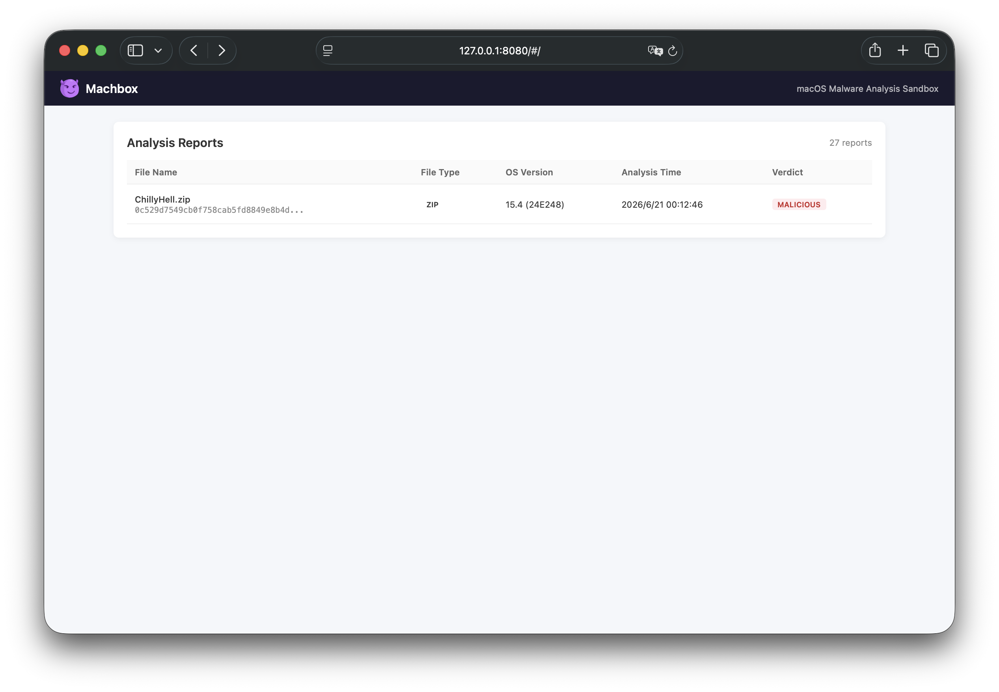

# Machbox

`Machbox` is a lightweight, native macOS sandbox for malware analysis, built on Apple native frameworks (`Virtualization.framework`, `EndpointSecurity.framework`, `DTrace`, etc.).



## Supported Formats

- mach-o
- Application Bundle
- Disk Image(.dmg)
- Package(.pkg)
- zip archive (supports password extraction)

## System Requirements

- **Apple Silicon Mac**
- **macOS 13+**

## Download

```bash
brew install ac0d3r/tap/machbox
```

Prebuilt Apple Silicon binaries are also on the [GitHub Releases](https://github.com/ac0d3r/machbox/releases) page.

```bash
curl -L -o machbox https://github.com/ac0d3r/machbox/releases/latest/download/machbox-darwin-arm64
chmod +x machbox
```

> The release binary is ad-hoc signed, macOS Gatekeeper will block it until you remove the quarantine attribute with `xattr -d com.apple.quarantine`.

## Build from Source

- Go 1.25+
- Node.js 20+ (includes npm)
- Swift 5.9+
- Xcode, for the macOS SDK, `codesign`, `pkgbuild`, and `hdiutil`

```bash
git clone https://github.com/ac0d3r/machbox.git
cd machbox
make build
```

The compiled binary will be at `bin/machbox`.

## Usage

- [Environment Setup](./docs/environment-setup.md): prepare a VirtualBuddy VM once before analyzing samples.
- [Usage](./docs/usage.md): analyze samples and read reports.

## Acknowledgments

- https://github.com/blacktop/go-macho
- https://github.com/Code-Hex/vz
- https://github.com/insidegui/VirtualBuddy
