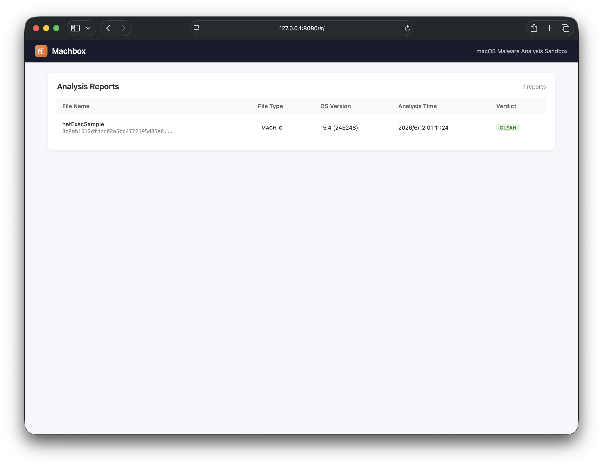
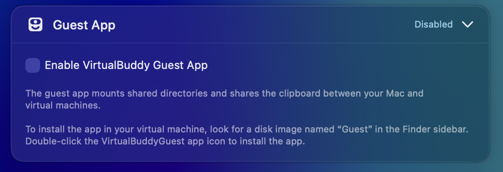
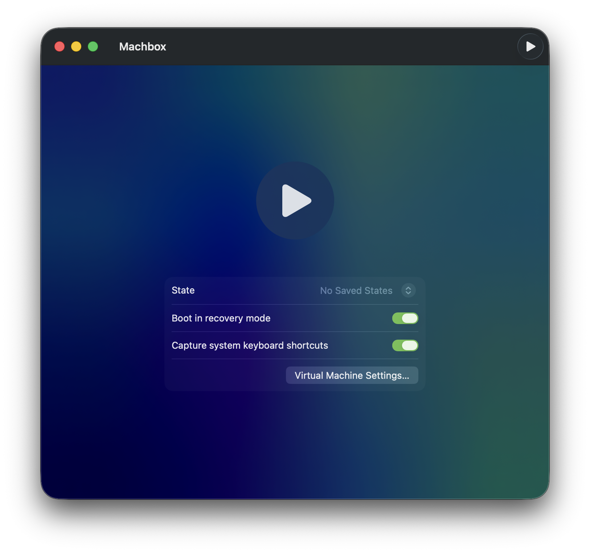
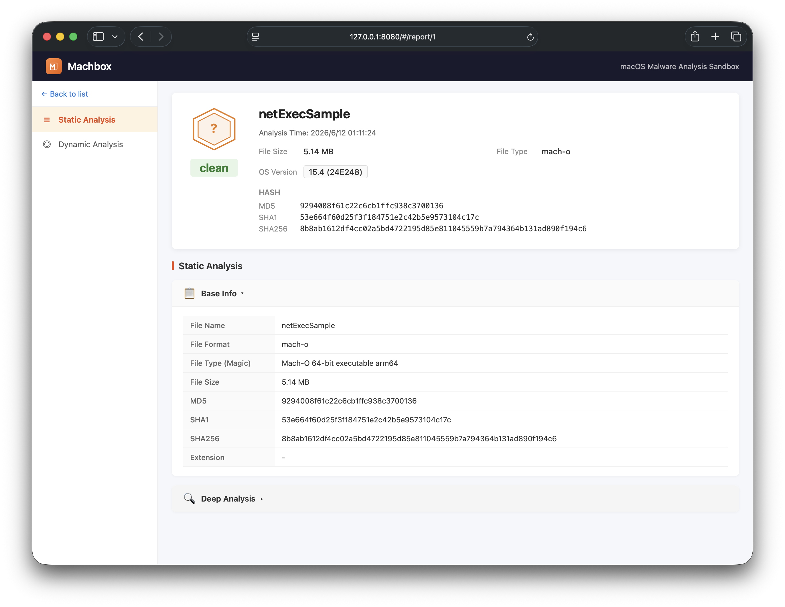
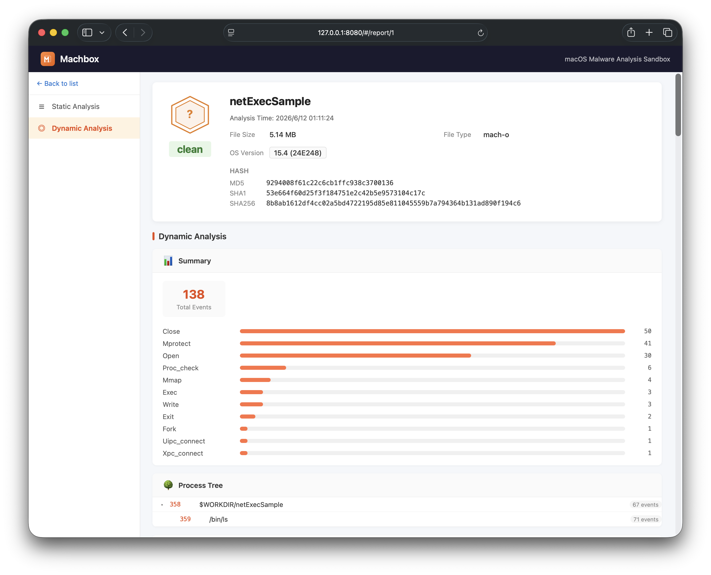
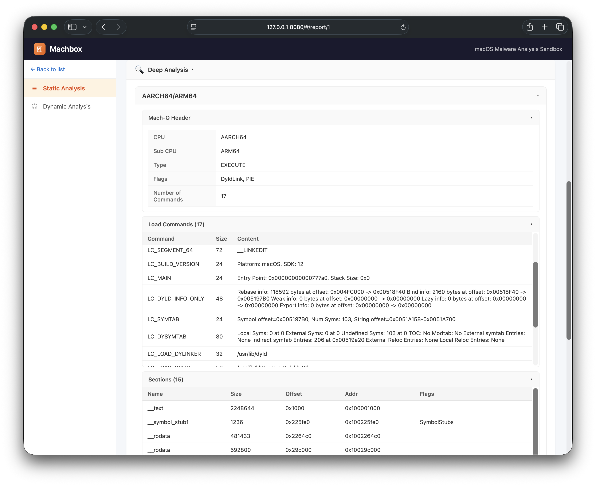
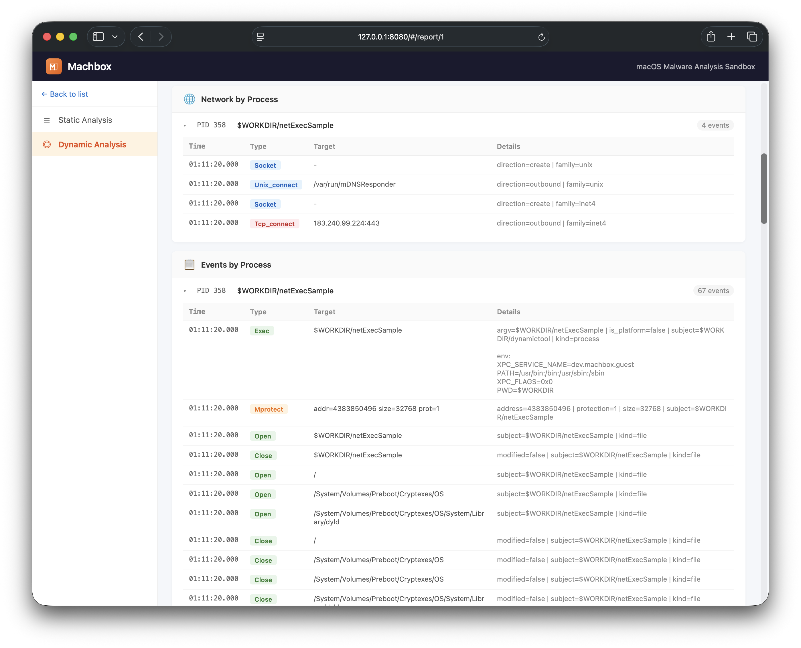
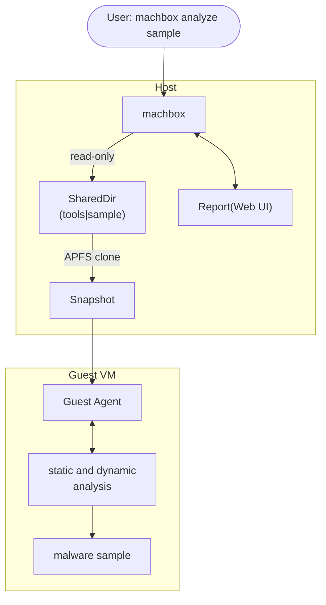

# MachBox

Machbox 是一款面向 macOS 的原生、轻量、单二进制恶意软件分析沙盒，集成动静态分析能力，基于 Apple 原生框架构建（`Virtualization.framework`、`EndpointSecurity.framework`、`DTrace` 等）。

[English](../README.md) | 中文




## 支持格式

- mach-o
- .app bundle
- zip archive（支持密码解压）

## 系统要求

- **Apple Silicon Mac**
- **macOS 13+**

## 环境准备

只需执行一次，准备好后即可反复运行样本分析。

> **提示：** 为了提高效率，完成以下步骤后可以创建一个 [VM 模板](./vm-template.md) 作为干净的“黄金镜像”，每次分析前复制一份使用。

### 1. 使用 VirtualBuddy 创建基础虚拟机

1. 打开 [VirtualBuddy](https://github.com/insidegui/VirtualBuddy) 并创建一个新的 macOS 虚拟机。

2. 创建过程中 **取消勾选 "Enable VirtualBuddy Guest App"**。
    
    

3. 在虚拟机内完成 macOS 初始化设置（地区、账户等）。

### 2. 在虚拟机中关闭 SIP

1. 在 VirtualBuddy 中，为虚拟机启用 **Boot in recovery mode**。

    

2. 启动虚拟机，从顶部菜单栏选择 **Utilities → Terminal**。

3. 运行：

   ```bash
   csrutil disable
   ```

4. 正常重启虚拟机。

### 3. 安装 Machbox Guest Agent

在宿主机上运行：

```bash
machbox setup -m /path/to/your_Machbox.vbvm
```

在虚拟机中：

1. 打开 Finder，从侧边栏选择 `MachboxGuest`。
2. 安装 `machbox-guest.pkg`。
3. 等待安装完成（Xcode Command Line Tools 会被静默安装）。
4. 关闭虚拟机。

---

## 分析样本

```bash
machbox analyze -m /path/to/your_Machbox.vbvm /path/to/sample
```

常用选项：

| 选项 | 说明 | 默认值 |
|------|------|--------|
| `-m, --vbvm` | **必需** VirtualBuddy 虚拟机包路径 | — |
| `--timeout` | 动态分析超时时间（秒） | `60` |
| `--password` | 加密压缩包的解压密码 | — |
| `--headless` | 无 GUI 模式运行（分析完成后自动关机） | `true` |
| `--display` | 分辨率设置 | `1920x1200` |
| `--network-mode` | 网络模式（如 `NAT`） | 禁用 |

## 查看分析报告

所有分析结果自动存入本地数据库，通过内置 Web UI 可视化查看：

```bash
machbox report-view
```

打开浏览器访问 `http://127.0.0.1:8080` 即可浏览完整的分析报告。

### 分析报告示例

| Static Analysis | Dynamic Analysis |
|:--|:--|
|  |  |
|  |  |

## 架构



## 致谢

- https://github.com/blacktop/go-macho
- https://github.com/Code-Hex/vz
- https://github.com/insidegui/VirtualBuddy
