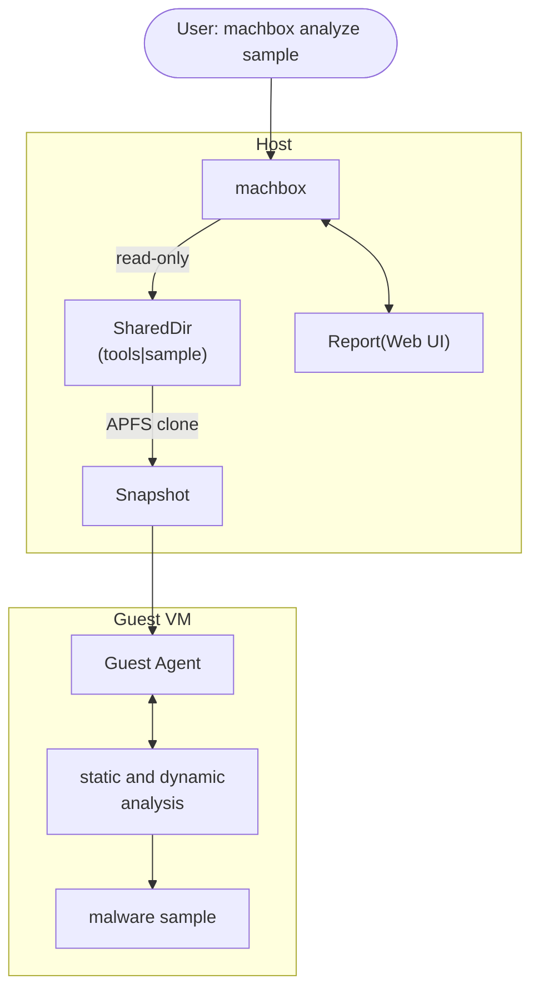

# Architecture

```mermaid
flowchart TB
    User(["User: machbox analyze sample"])

    subgraph Host["Host"]
        Machbox["machbox"]
        Snapshot["Snapshot"]
        ShareDir["SharedDir<br>(tools|sample)"]
        Report["Report(Web UI)"]
    end

    subgraph Guest["Guest VM"]
        Agent["Guest Agent"]
        Analysis["static and dynamic<br>analysis"]
        Sample["malware sample"]
    end

    User --> Machbox
    Machbox --> |read-only|ShareDir
    ShareDir --> |APFS clone|Snapshot
    Snapshot --> Agent
    Agent <--> Analysis
    Analysis --> Sample
    Machbox <--> Report
```