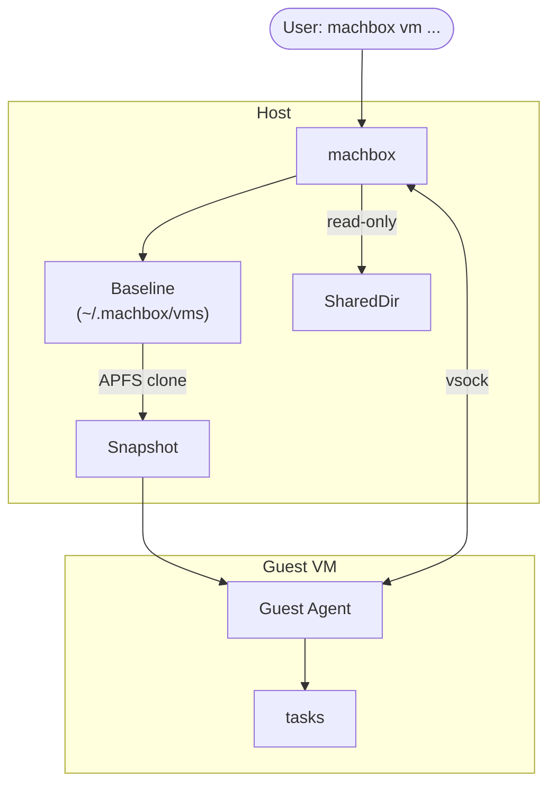

# Architecture

```mermaid
flowchart TB
    User(["User: machbox vm ..."])

    subgraph Host["Host"]
        Machbox["machbox"]
        Baseline["Baseline<br>(~/.machbox/vms)"]
        Snapshot["Snapshot"]
        ShareDir["SharedDir"]
    end

    subgraph Guest["Guest VM"]
        Agent["Guest Agent"]
        Task["tasks"]
    end

    User --> Machbox
    Machbox --> Baseline
    Baseline --> |APFS clone|Snapshot
    Machbox --> |read-only|ShareDir
    Snapshot --> Agent
    Machbox <--> |vsock|Agent
    Agent --> Task
```
