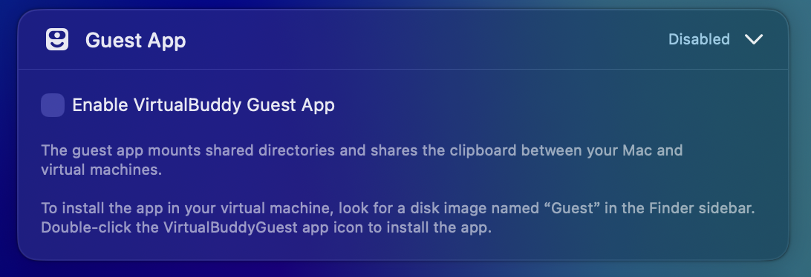
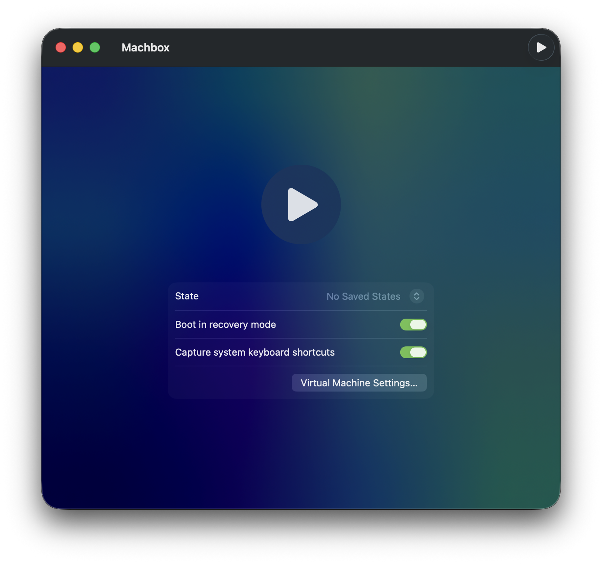

# Environment Setup

Only needs to be done once. After setup, you can run sample analysis repeatedly.

## Create a Base VM with VirtualBuddy

- Open [VirtualBuddy](https://github.com/insidegui/VirtualBuddy) and create a new macOS VM.

    - Optional (during creation, uncheck "Enable VirtualBuddy Guest App")

      

3. Complete the macOS setup inside the VM (region, account, etc.).

## Disable SIP in the Guest VM

1. In VirtualBuddy, enable **Boot in recovery mode** for the VM.



2. Start the VM and open **Utilities → Terminal** from the menu bar.

3. Run:

   ```bash
   csrutil disable
   ```

4. Restart the VM normally.

## Install the Machbox Guest Agent

On the host, run the command below. It opens the VM window:

```bash
machbox vm import /path/to/your_Machbox.vbvm <name>
```

In the VM window:

1. Open Finder and select `MachboxGuest` from the sidebar.
2. Install `machbox-guest.pkg`.
3. Wait for the installation to finish (Xcode Command Line Tools will be installed silently).
4. After the checks pass, close the VM window to finish the import.
