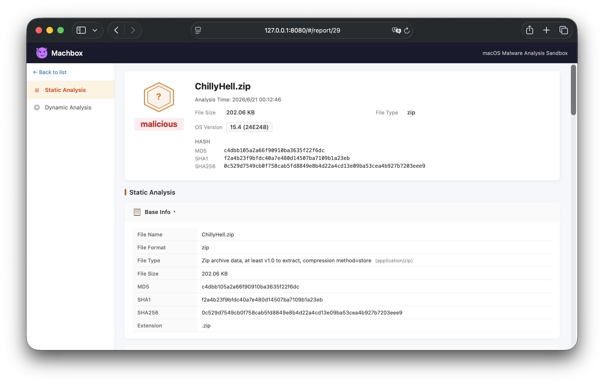
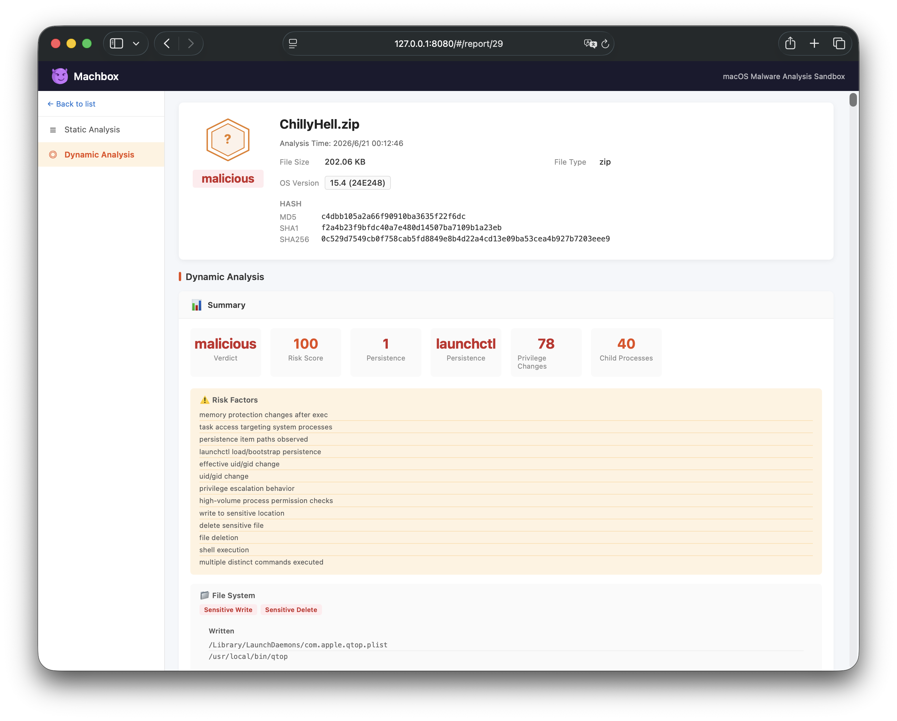
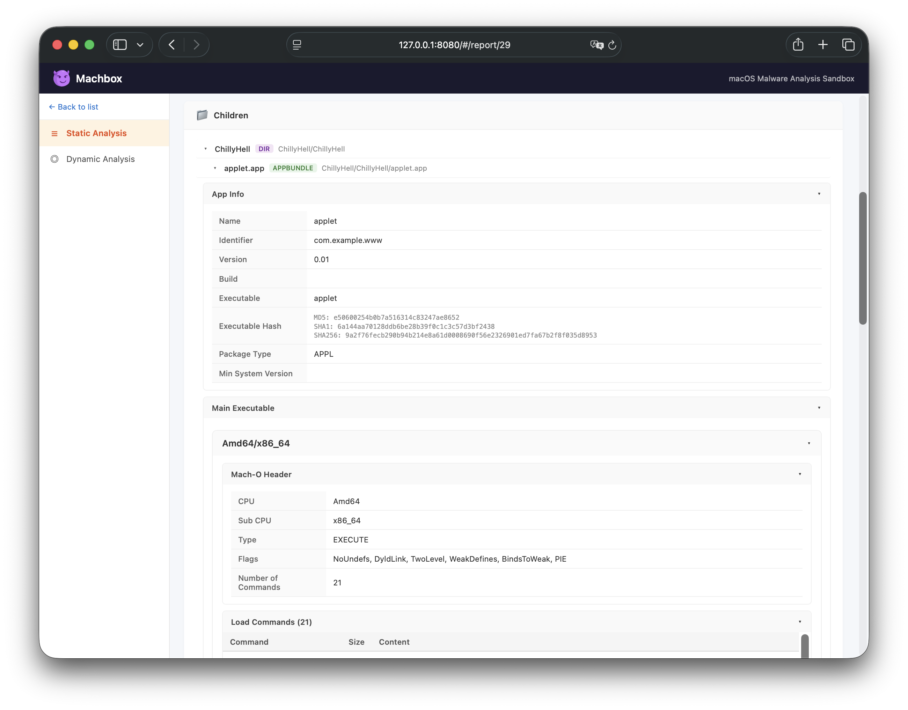
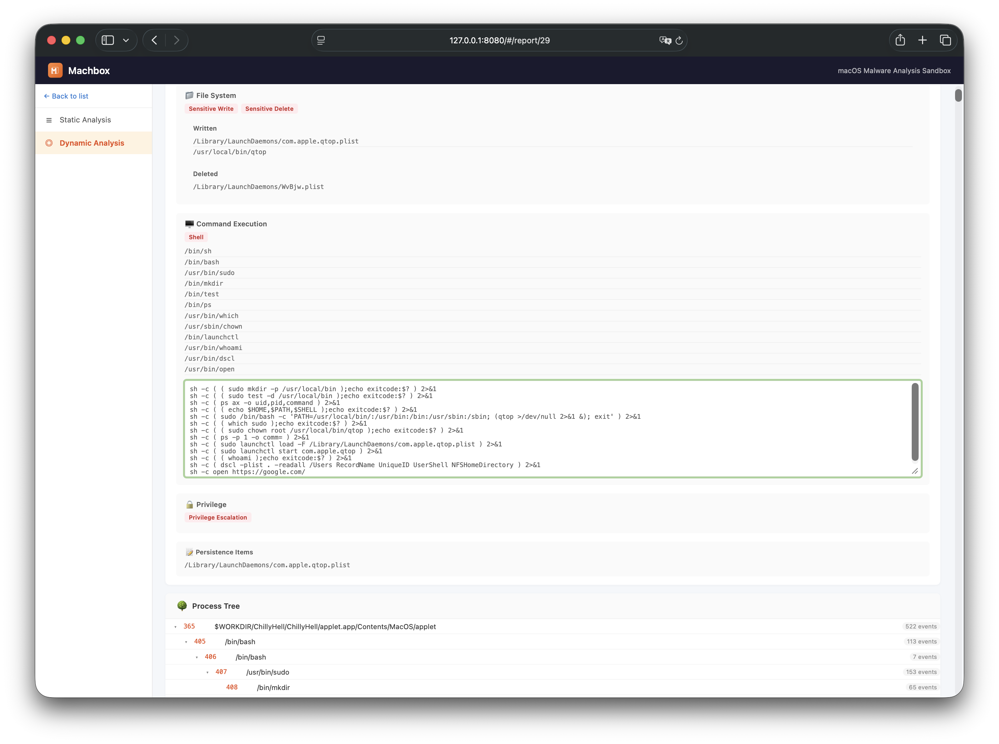

# Usage

## Analyze Samples

```bash
machbox analyze -m my-baseline /path/to/sample
```

When only one baseline has been imported, `--vm` can be omitted:

```bash
machbox analyze /path/to/sample
```

Common options:

| Option | Description | Default |
|--------|-------------|---------|
| `-m, --vm` | Baseline UUID or unique name. Required when more than one baseline is imported | — |
| `--timeout` | Dynamic analysis timeout (seconds) | `120` |
| `--password` | Password for encrypted archives | — |
| `--headless` | Run without a GUI window (auto-shutdown after analysis) | `true` |
| `--display` | Display resolution | `1920x1200` |
| `--network-mode` | Network mode (`NAT`) | Disabled |

Supports passing command-line arguments to the sample:

```bash
machbox analyze [flags] <sample> [--] [sample-args...]
```

## View Analysis Reports

Analysis results are stored in a local database and shown in the built-in web UI:

```bash
machbox report-view
```

Open `http://127.0.0.1:8080` to browse the reports.

### Report Preview

| Static Analysis | Dynamic Analysis |
|:--|:--|
|  |  |
|  |  |
